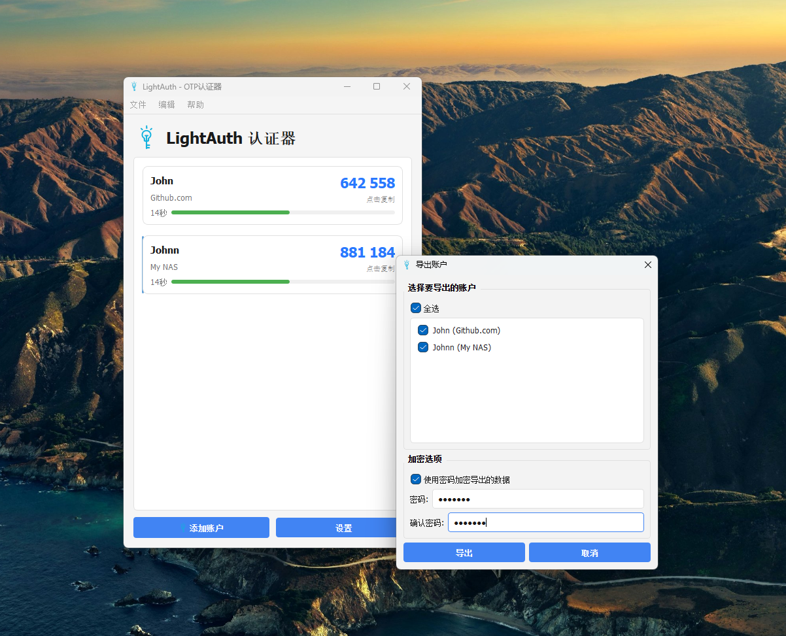

# LightAuth - 轻量级开源 OTP 认证器

> 桌面端 (Windows / macOS) 一次性密码 (TOTP) 管理器，使用 **Qt 6** 构建，可作为 Google Authenticator / Microsoft Authenticator 的本地替代方案。

---

## ✨ 主要特性

- **基于时间的一次性密码 (TOTP)**
- **本地 AES-256 加密存储**，数据绝不出本机
- **多种账号添加方式**：手动输入、二维码扫描
- 倒计时进度环直观展示剩余有效时间
- 一键复制验证码到剪贴板
- 账户编辑、删除
- 账户数据 **导入 / 导出**
- 简洁明快的 UI 动画与多主题支持

## 🔐 数据安全

- 账号数据使用 **对称加密 (cryptography.Fernet, AES-256)** 进行本地加密
- 加密密钥存储在操作系统的凭据管理器 / Keychain 中（未来计划）
- **绝不联网、绝不上传**，数据完全离线

## 📄 许可证

本项目基于 **MIT License** 开源，详情见 [`LICENSE`](LICENSE)。

---

如果 LightAuth 对你有帮助，记得 Star 支持一下！ 